# Laporan Praktikum Pemrograman Berbasis Objek

## joobshet 2

## Identintas Mahasiswa 

- **Nama** : M.Hafidz Azki Ramadhan
- **Nim**  : 254107020177
- **Kelas** : TI-2G
- **Repository* :

## Percobaan 

## Figure 1
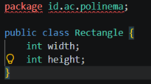
## Figure 2
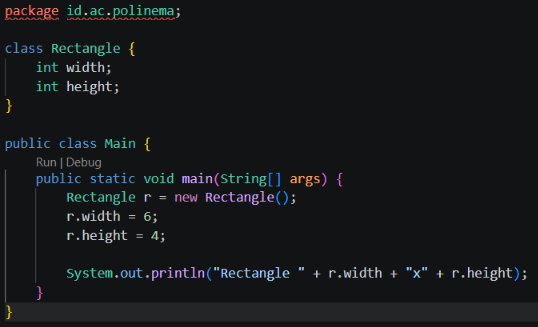
## Figure 3
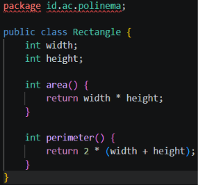
## Figure 4 
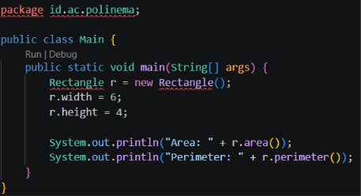
## Figure 5
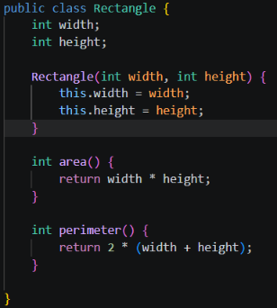
## Figure 6 
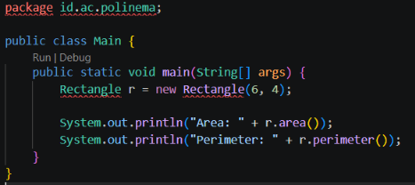
## Figure 8 
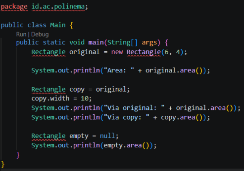
## Figure 10 
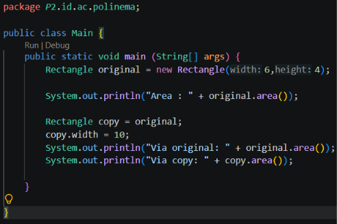
## Figure 12
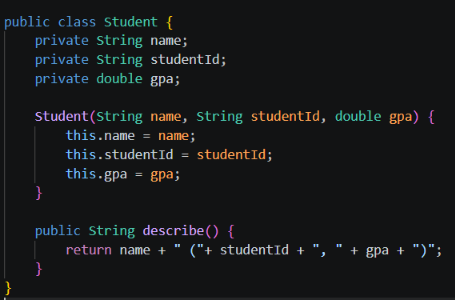
## Figure 13
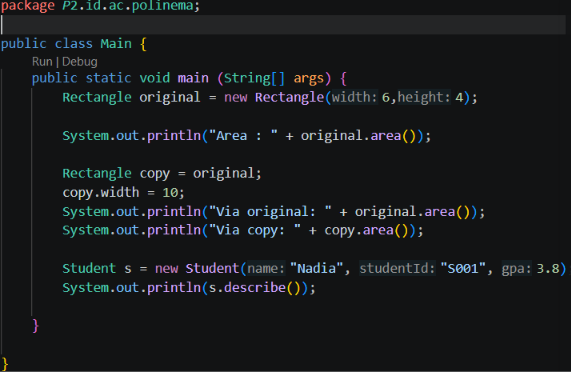
## Figure 14
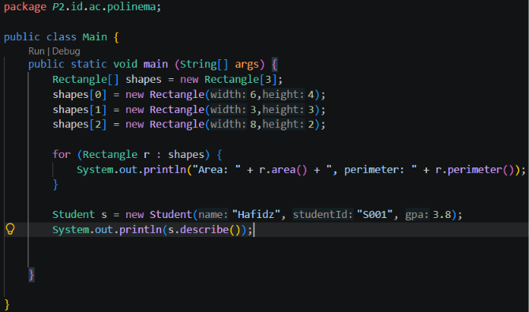

**Output**
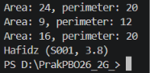

## Tugas Praktikum

## Kode
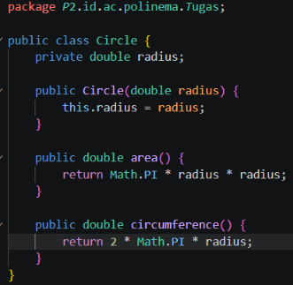
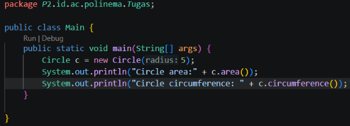

**Output**
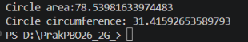fvytf

## Pertanyaan

2. Jawab singkat (2-3 kalimat masing-masing): 

   (a) apa bedanya objek dengan referensi ke objek?
    **Jawab**Objek adalah data nyata yang disimpan di memori heap, sedangkan referensi hanyalah alamat/penunjuk di stack yang mengarah ke objek tersebut
    
   (b) tepatnya kapan konstruktor sebuah kelas dijalankan?
    **Jawab**Konstruktor dijalankan tepat saat sebuah objek dibuat dengan keyword new