# Laporan Praktikum Pemrograman Berbasis Objek

## joobshet 3

## Identintas Mahasiswa 

- **Nama** : M.Hafidz Azki Ramadhan
- **Nim**  : 254107020177
- **Kelas** : TI-2G
- **Repository* : 

## 3. Percobaan 

## 3.1 Percobaan 1
**Output**
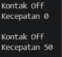

## 3.2 Percobaan 2
**Output**
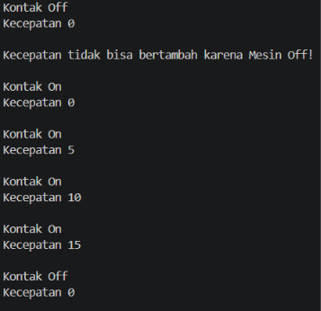

## 3.3 Pertanyaan
1. Pada class TestMobil, saat kita menambah kecepatan untuk pertama kalinya, mengapa
muncul peringatan “Kecepatan tidak bisa bertambah karena Mesin Off!”?
**Jawaban** karena atribut kontakOn masih bernilai false

2. Mengapa atribut kecepatan dan kontakOn diset private?**Jawaban** supaya nilai atribut tidak tidak bisa diubahh dari luar kelas

3. Ubah class Motor sehingga kecepatan maksimalnya adalah 100!
**Jawaban** 
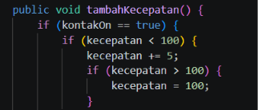

## 3.4 Percobaan 3
**Output**
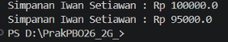

## 3.5 Percobaan 4
**Output**
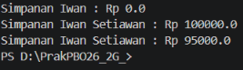

## 3.6 Pertanyaan - Percobaan 3 dan 4
1. Apa yang dimaksud getter dan setter?
**Jawaban** Getter adalah method untuk mengambil nilai dari atribut private,Setter adalah method untuk mengubah nilai atribut private

2. Apa kegunaan dari method getSimpanan()?
**Jawaban** untuk membaca nilai simpanan anggota secara aman

3. Method apa yang digunakan untuk menambah saldo?
**Jawaban** method setor(float uang)

4. Apa yang dimaksud konstruktor?
**Jawaban** method khusus yang dipanggil saat objek dibuat

5. Sebutkan aturan dalam membuat konstruktor?
**Jawaban** nama konstruktor harus sama dengan nama class,tidak memiliki tipe return

6. Apakah boleh konstruktor bertipe private?
**Jawaban** boleh tapi penggunaannya terbatas

7. Kapan menggunakan konstruktor dengan passing parameter?
**Jawaban** saat atribut butuh nilai spesifik

8. Apa perbedaan inisialisasi atribut dan instansiasi atribut?
**Jawaban** inisialisasi atribut memberi nilai awal pada atribut, instansiasi atribut membuat objek dari class

9. Apa perbedaan inisialisasi method dan instansiasi method? 
**Jawaban** inisialisasi method mendefinisikan method di dalam class, instansiasi method memanggil method dari objek yang sudah dibuat

## 5. Tugas

## 1.Cobalah program dibawah ini dan tuliskan hasil outputnya
**Jawaban**
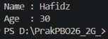

## 2.Pada program diatas, pada class EncapTest kita mengeset age dengan nilai 35, namun pada saat ditampilkan ke layar nilainya 30,jelaskan mengapa
**Jawaban**
Karena pada method setAge(int newAge) terdapat kondisi if (newAge > 30), sehingga nilai age secara otomatis dipatok maksimal ke 30

## 3.Ubah program diatas agar atribut age dapat diberi nilai maksimal 30 dan minimal 18
**Jawaban**
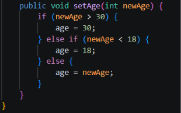

## 4.Buat class kontainer
**Jawaban**
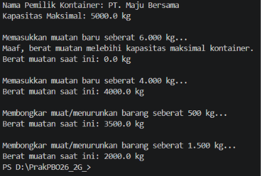

## 5.Modifikasi soal kargo logistik
**Jawaban**
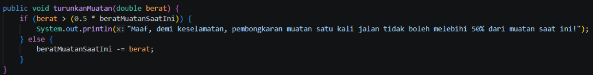

## 6.Modifikasi kelas Main TestLogistik 
**Jawaban**
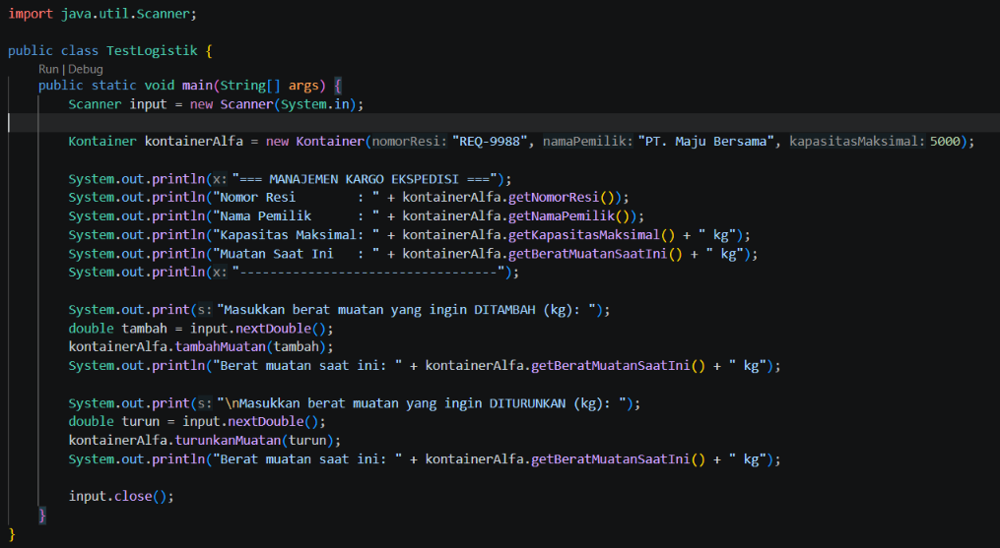

## 7.Membuat pemesanan tiket bioskop
**Jawaban**
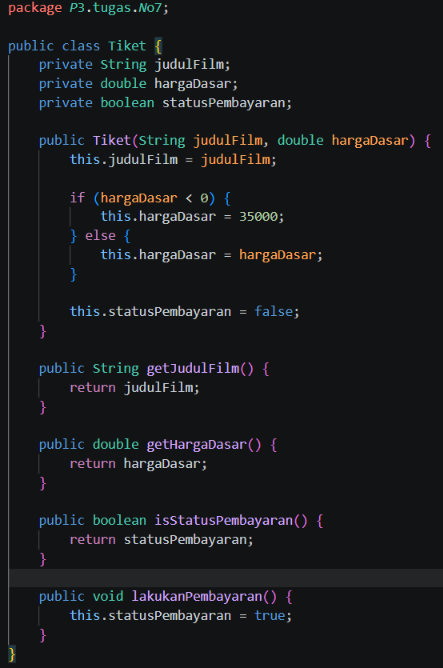
**Output**
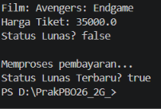