<div align="center">



# ᴘʀᴀᴋᴛɪᴋᴜᴍ ᴘᴇᴍʀᴏɢʀᴀᴍᴀɴ ʙᴇʀʙᴀꜱɪꜱ ᴏʙᴊᴇᴋ

**`Object-Oriented Programming` · `Java` · `TI-2G` · `2026`**

Setiap kelas adalah *cetakan*. Setiap objek adalah **entitas yang hidup**.
Repositori ini merekam jejak pembelajaran tersebut — dari satu `class`
sederhana, sampai **enkapsulasi, pewarisan, dan relasi antar kelas**.

<br/>


<sub>**[ MODUL ]** &nbsp;`01` Kelas & Objek &nbsp;`02` Konstruktor &nbsp;`03` Encapsulation &nbsp;`04` Relasi &nbsp;`06` Inheritance</sub>

</div>

---

## ⌁ Tʀᴀɴꜱᴍɪꜱꜱɪ Oᴠᴇʀᴠɪᴇᴡ

> **PBO (*Object-Oriented Programming*)** bukan sekadar cara menulis kode — ia adalah cara
> **memodelkan dunia nyata** ke dalam perangkat lunak. Repositori ini merekam proses
> penguasaan pemodelan tersebut, dengan **Java** sebagai instrumen.

| Parameter | Nilai |
| :--- | :--- |
| **Mata Kuliah** | Praktikum Pemrograman Berbasis Objek (PBO) |
| **Program Studi** | Teknologi Informasi — Politeknik Negeri Malang |
| **Kelas / Tahun** | TI-2G · 2026 |
| **Bahasa** | Java — *compiled, statically typed, object-oriented* |
| **Toolchain** | `javac` + `java` (JDK 21+), tanpa *build tool* |
| **Unit Praktik** | 85 berkas `.java` · 29 titik masuk `main()` · 5 laporan |
| **Pendekatan** | *Design-first*: memahami **mengapa** sebuah struktur kelas dirancang |

---

## ⌁ Aʀꜱɪᴛᴇᴋᴛᴜʀ Rᴇᴘᴏꜱɪᴛᴏʀɪ

Setiap direktori **`P<n>/`** adalah satu **jobsheet** — satu stasiun dalam perjalanan
memahami PBO. Di dalamnya, tiap sub-folder adalah satu **package** Java yang mandiri.

```text
PrakPBO26_2G_17/
│
├── P1/   ▸ Kelas & Objek · Inheritance dasar
│   ├── Bike/                    Bike ──▸ RoadBike
│   └── Tugas/                   Kendaraan ──▸ Mobil, SepedaMotor  +  Televisi, Speaker
│
├── P2/   ▸ Konstruktor, Overloading & Objek Array
│   └── id/ac/polinema/          Main · Rectangle · Student   (package berjenjang)
│
├── P3/   ▸ Encapsulation & Access Modifier
│   ├── motorencapsulation/      percobaan1 · percobaan2   (Motor · MotorDemo)
│   ├── koperasigettersetter/    percobaan3 · percobaan4   (Anggota · KoperasiDemo)
│   └── tugas/                   No1 · No3 · No4 · No5 · No6 · No7
│
├── P4/   ▸ Relasi Kelas : Aggregation · Composition · Dependency
│   ├── LaptopProcessor/         Laptop ◇─ Processor        (aggregation 1─1)
│   ├── RentalMobil/             Pelanggan ◇─ Mobil, Sopir  (aggregation ganda)
│   ├── KeretaApi/               KeretaApi ◇─ Pegawai × 2   (dua role, kelas sama)
│   ├── GerbongKereta/           Gerbong ◇─ Kursi[] ─▸ Penumpang   (multiplicity)
│   ├── MobilMesin/              Mobil ◆─ Mesin             (composition)
│   └── LaptopPrinter/           Laptop ┈▸ Printer          (dependency / uses-a)
│
├── P6/   ▸ Inheritance Lanjutan : Override · super · protected · Array of Object
│   ├── percobaan1..5/           rantai pewarisan bertingkat + Desktop/Laptop/Workstation
│   ├── pengayaan/               Character ──▸ Human, Angel, Wizard
│   ├── tugas1/                  Pegawai ──▸ Dosen (override perhitungan gaji)
│   └── tugas2/                  Televisi ──▸ TelevisiModern
│
└── assets/readme/               Aset visual dokumentasi
```

### Peta Modul

| # | Jobsheet | Konsep Inti | Titik Masuk | Laporan |
| :-: | :--- | :--- | :--- | :--- |
| `01` | **Kelas & Objek** | `class`, `object`, `new`, atribut & method, pewarisan dasar (`extends`) | `P1.Bike.BikeDemo` · `P1.Tugas.Demo` | [`P1/report.md`](P1/report.md) |
| `02` | **Konstruktor & Objek Array** | konstruktor, *setter/getter*, array of object, package berjenjang | `P2.id.ac.polinema.Main` · `...Tugas.Main` | [`P2/report.md`](P2/report.md) |
| `03` | **Encapsulation** | `private`, getter/setter, validasi & *guard clause*, access modifier | `P3.*.MotorDemo` · `P3.tugas.No*.Test*` | [`P3/report.md`](P3/report.md) |
| `04` | **Relasi Kelas** | **Aggregation** ◇ · **Composition** ◆ · **Dependency** ┈▸ | `P4.*.MainPercobaan1..6` | [`P4/Laporan.md`](P4/Laporan.md) |
| `06` | **Inheritance Lanjutan** | `@Override`, `super`, `protected`, rantai pewarisan | `P6.percobaan1..5.*` · `P6.tugas1.MainTugas1` | [`P6/Laporan.md`](P6/Laporan.md) |

> [!NOTE]
> **Jobsheet 5 tidak ada di repositori ini** — penomoran direktori mengikuti penomoran
> pertemuan, bukan urutan berkas.

---

## ⌁ Rᴇʟᴀꜱɪ Aɴᴛᴀʀ Kᴇʟᴀꜱ — Jᴀɴᴛᴜɴɢ Jᴏʙꜱʜᴇᴇᴛ 4

Inti Jobsheet 4: **tiga cara sebuah objek berhubungan dengan objek lain.**

```text
  AGGREGATION  ◇  has-a · kepemilikan lemah
      whole ──◇ part          part hidup mandiri, disuntik lewat konstruktor/setter
      └ Laptop ◇ Processor · Pelanggan ◇ Mobil + Sopir · KeretaApi ◇ Pegawai (×2)
                            └ Gerbong ◇ Kursi[]

  COMPOSITION  ◆  has-a · kepemilikan kuat & eksklusif
      whole ──◆ part          part diciptakan & dimusnahkan bersama whole
      └ Mobil ◆ Mesin         Mesin dibuat di dalam konstruktor Mobil, tanpa setter publik

  DEPENDENCY   ┈▸ uses-a · hubungan sesaat
      client ┈▸ service       hanya parameter method / variabel lokal, bukan atribut
      └ Laptop ┈▸ Printer     cetakDokumen(Printer printer, String namaFile)
```

**Kaidah penentu** — tanyakan: *siapa yang mengendalikan daur hidup objek itu?*

| Bila `part`… | Maka relasinya |
| :--- | :--- |
| Dapat hidup mandiri & disuntik dari luar | **Aggregation** ◇ |
| Hanya bermakna sebagai bagian dari `whole` | **Composition** ◆ |
| Dibutuhkan sekejap pada satu operasi saja | **Dependency** ┈▸ |

### ⌁ Anatomi ketiganya dalam kode

**① Aggregation** — `part` disuntikkan lewat *setter*, hidup di luar:

```java
// P4/RentalMobil/Pelanggan.java
private Mobil mobil;
private Sopir sopir;

public void setMobil(Mobil mobil) { this.mobil = mobil; }
public void setSopir(Sopir sopir) { this.sopir = sopir; }

public int hitungBiayaTotal() {
    return mobil.hitungBiayaMobil(hari) + sopir.hitungBiayaSopir(hari);
}
```

**② Composition** — `part` diciptakan sendiri di dalam konstruktor, tanpa setter:

```java
// P4/MobilMesin/Mobil.java
private Mesin mesin;

public Mobil(String merek) {
    this.merek = merek;
    this.mesin = new Mesin();      // ← Mesin lahir bersama Mobil
}
```

**③ Dependency** — `part` hanya *mampir* sebagai parameter method:

```java
// P4/LaptopPrinter/Laptop.java
public void cetakDokumen(Printer printer, String namaFile) {
    System.out.println(merk + " mengirim dokumen ke printer...");
    printer.cetak(namaFile);       // ← Printer tidak pernah disimpan sebagai atribut
}
```

---

## ⌁ Cᴀʀᴀ Mᴇɴᴊᴀʟᴀɴᴋᴀɴ

**Prasyarat tunggal: JDK 21 atau lebih baru** *(diuji dengan OpenJDK 25)*.

```bash
java -version    # openjdk version "21" (atau lebih baru)
javac -version
```

### Kompilasi seluruh repositori (sekali jalan)

Dari **root** repositori, seluruh 85 berkas `.java` dapat dikompilasi sekaligus:

```bash
find P1 P2 P3 P4 P6 -name '*.java' > /tmp/sources.txt
mkdir -p .dist && javac -d .dist @/tmp/sources.txt
```

> `.dist` sudah terdaftar di `.gitignore`, sehingga hasil kompilasi tidak ikut ter-commit.

### Menjalankan program

Program dipanggil dengan **classpath** (`-cp`) dan **nama package lengkap**:

```bash
java -cp .dist P1.Bike.BikeDemo
java -cp .dist P3.tugas.No7.TestBioskop
java -cp .dist LaptopProcessor.MainPercobaan1
```

> [!WARNING]
> **Perhatikan deklarasi `package`.** Kelas di `P1`, `P2`, `P3` memakai prefix
> (`package P1.Bike;`), tetapi kelas di `P4` dan `P6` berada di **root namespace**
> (`package LaptopProcessor;`, `package tugas1;`) — jalankan **tanpa** prefix `P4.`/`P6.`:

```bash
java -cp .dist P4.LaptopProcessor.MainPercobaan1   # ✗ ClassNotFoundException
java -cp .dist LaptopProcessor.MainPercobaan1      # ✓ benar
```

### Mode *single-file* (tanpa langkah kompilasi manual)

Semenjak JDK 11, Java dapat mengompilasi *on the fly* — praktis saat
mengeksplorasi satu percobaan:

```bash
java P1/Bike/BikeDemo.java
java P4/MobilMesin/MainPercobaan5.java
```

> [!TIP]
> `find` di atas melewatkan folder `assets`, `.git`, dan `.vscode` secara otomatis,
> jadi daftar sumber selalu bersih.

### Dari dalam folder `P4` / `P6`

Karena kelas P4/P6 berada di root namespace, menjalankannya dari dalam foldernya pun
cukup dengan classpath relatif:

```bash
cd "P4"
java -cp ../.dist LaptopProcessor.MainPercobaan1
java -cp ../.dist MobilMesin.MainPercobaan5

cd "../P6"
java -cp ../.dist tugas1.MainTugas1
```

> [!IMPORTANT]
> Nama folder repositori memuat **spasi** — selalu bungkus path dengan tanda kutip
> (`"P4/Laporan.md"`) pada shell.

### Indeks titik masuk `main()`

<details>
<summary><b>▸ 29 titik masuk — klik untuk membuka</b></summary>

<br/>

**P1 — Kelas & Objek**
```bash
java -cp .dist P1.Bike.BikeDemo
java -cp .dist P1.Tugas.Demo
```

**P2 — Konstruktor & Objek Array**
```bash
java -cp .dist P2.id.ac.polinema.Main
java -cp .dist P2.id.ac.polinema.Tugas.Main
```

**P3 — Encapsulation**
```bash
java -cp .dist P3.motorencapsulation.percobaan1.MotorDemo
java -cp .dist P3.motorencapsulation.percobaan2.MotorDemo
java -cp .dist P3.koperasigettersetter.percobaan3.KoperasiDemo
java -cp .dist P3.koperasigettersetter.percobaan4.KoperasiDemo
java -cp .dist P3.tugas.No1.EncapTest
java -cp .dist P3.tugas.No4.TestLogistik
java -cp .dist P3.tugas.No5.TestLogistik
java -cp .dist P3.tugas.No6.TestLogistik     # interaktif: membaca input dari keyboard
java -cp .dist P3.tugas.No7.TestBioskop
```

**P4 — Relasi Kelas** *(tanpa prefix `P4.`)*
```bash
java -cp .dist LaptopProcessor.MainPercobaan1     # Aggregation 1─1
java -cp .dist RentalMobil.MainPercobaan2         # Aggregation ganda
java -cp .dist KeretaApi.MainPercobaan3           # Dua role ke kelas sama
java -cp .dist KeretaApi.MainPertanyaan           # + validasi masinis
java -cp .dist GerbongKereta.MainPercobaan4       # Array of object / multiplicity
java -cp .dist GerbongKereta.MainPertanyaan4      # Validasi kursi terisi
java -cp .dist MobilMesin.MainPercobaan5          # Composition
java -cp .dist LaptopPrinter.MainPercobaan6       # Dependency
```

**P6 — Inheritance Lanjutan** *(tanpa prefix `P6.`)*
```bash
java -cp .dist percobaan1.MainPercobaan1
java -cp .dist percobaan2.MainPercobaan2
java -cp .dist percobaan3.MainPercobaan3
java -cp .dist percobaan4.MainPercobaan4
java -cp .dist percobaan5.MainPercobaan5
java -cp .dist pengayaan.MainTugas3
java -cp .dist tugas1.MainTugas1
java -cp .dist tugas2.MainTugas2
```

</details>

---

## ⌁ Aʟᴜʀ Wᴏʀᴋꜰʟᴏᴡ Pʀᴀᴋᴛɪᴋᴜᴍ

```text
  ┌─ 01 ────────────┐   ┌─ 02 ────────────┐   ┌─ 03 ────────────┐
  │  Baca jobsheet  │──▸│  Tulis & uji    │──▸│  Dokumentasi    │
  │  & teori modul  │   │  kode Java      │   │  laporan + jawab│
  └─────────────────┘   └─────────────────┘   └─────────────────┘
         ▲                                              │
         └─────────────── 04 · Refleksi ◂───────────────┘
```

| Tahap | Keluaran |
| :-: | :--- |
| `01` | Pemahaman konsep: **mengapa** struktur kelas dirancang demikian |
| `02` | Package Java yang dapat dikompilasi & dijalankan |
| `03` | Laporan `.md`: teori · potongan kode · *screenshot* keluaran · jawaban pertanyaan |
| `04` | Kesimpulan: kapan satu relasi lebih tepat daripada relasi lain |

> [!TIP]
> **Cara membaca laporan.** Setiap laporan memuat blok kode & keluaran program apa
> adanya. Bila hanya menyunting prosa, **jangan** mengubah isinya — kode dan keluaran
> merekam hasil eksekusi yang sebenarnya.

---

## ⌁ Kᴏɴᴠᴇɴꜱɪ Kᴏᴅᴇ

| Aspek | Konvensi yang dipakai di repositori |
| :--- | :--- |
| **Namespace** | `P1`–`P3` memakai prefix lengkap (`P1.Bike`); `P4`/`P6` di root (`LaptopProcessor`) |
| **Enkapsulasi** | Atribut selalu `private`, diakses lewat getter/setter |
| **Validasi** | *Guard clause* di dalam setter (mis. usia &gt; 30 ditolak, muatan melebihi kapasitas ditolak) |
| **Dokumentasi** | Setiap jobsheet disertai satu laporan `.md` + gambar keluaran |
| **Penamaan** | Kelas `PascalCase` · variabel/method `camelCase` · nama entitas berbahasa Indonesia pada konteks Indonesia (`Pelanggan`, `Gerbong`, `Tiket`) |
| **Titik masuk** | Satu kelas `Main*` per percobaan, berisi `public static void main` |

---

## ⌁ Iᴅᴇɴᴛɪᴛᴀꜱ

<div align="center">

**Muhammad Hafidz Azki** &nbsp;·&nbsp; `2541070177` &nbsp;·&nbsp; **TI-2G**

Teknologi Informasi — Politeknik Negeri Malang
Praktikum Pemrograman Berbasis Objek (PBO)

</div>

---

## ⌁ Cʟᴏꜱɪɴɢ Tʀᴀɴꜱᴍɪꜱꜱɪᴏɴ

<div align="center">

*"Membuat objek itu mudah — yang sulit adalah merancang **hubungan** antar objek
sehingga program dapat berubah tanpa harus dibongkar ulang."*

**Aggregation** ◇ &nbsp;·&nbsp; **Composition** ◆ &nbsp;·&nbsp; **Dependency** ┈▸
**Encapsulation** 🔒 &nbsp;·&nbsp; **Inheritance** 🧬

<sub>ᴘʀᴀᴋᴛɪᴋᴜᴍ ᴘᴇᴍʀᴏɢʀᴀᴍᴀɴ ʙᴇʀʙᴀꜱɪꜱ ᴏʙᴊᴇᴋ &nbsp;·&nbsp; ᴛɪ-2ɢ &nbsp;·&nbsp; 2026</sub>

</div>

---
